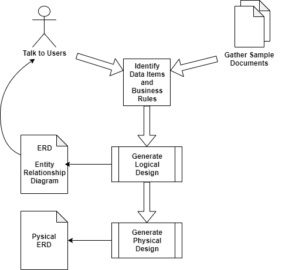

# Database Design

## DBMS/RDBMS

In its broadest understanding, a database can be thought of as a collection of data stored in one or more files. More commonly, a database is a data store that is accessed through a Database Management System (**DBMS**). Most database management systems store the data in a "relational" format; these are called Relational Database Management Systems (**RDBMS**). For example, Microsoft's SQL Server, Oracle, MySQL, and PostgreSQL are popular RDBMS programs.

It's important to make the distinction between the database and the DBMS. As already mentioned, the database itself is a collection of one or more files that contain the data. The DMBS/RDBMS provides *access* to that data so that we can read/edit/add/delete information in that database. A single DBMS/RDBMS installation can handle many databases.

The database stores more than just the data. It also stores **metadata**. Metadata is data that describes the *structure* of the data. Together, the metadata and data comprise the central components of a database.

The DBMS program that provides access to the data is comprised of five components.

- **DCL** - Data Control Language - Provides functionality surrounding the security requirements of the database
- **DDL** - Data Definition Language - Provides functionality around defining the structure (metadata) of the database
- **DML** - Data Manipulation Language - Provides the ability to add/edit/delete data in the database
- **Query Language** - Provides the ability to read information in the database
- **Proprietary Languages and Tools** - Provides capabilities unique to the vendor-specific Database Management System

DBMS/RDBMS programs act as an *intermediary* between the database and the software that software that uses the database. That is to say, programs that need a database never really access the database directly. Instead, they make all their requests to the database through the DBMS. They do so using a language called **Structured Query Language** (SQL). The SQL language embodies all of the intent of the DCL, DML, DDL, and Query Language. When sent to the DBMS, an SQL command is processed by the appropriate component of the DBMS to work on the database.

Both SQL and the DBMS offer several benefits to managing data.

- **Common Language Interface** - The SQL language offers a common way to work with data and databases, allowing programs a single consistent means of access regardless of the vendor-specific DBMS system used.
- **Better Security** - By using a DBMS, it is easier to secure the access to a database in both a broad and fine-grained manner.
- **Increased Performance** - The DBMS/RDBMS is optimized for high performance, including faster read/write times and the effecient use of memory (both RAM and hard-disk space).
- **Scalable** - By using a DBMS/RDBMS, it is easier to handle large increases in data volume by simply adding and configuring more hardware.

## Database Design Process

Database design is as much an art as it is a discipline. Generally speaking, the process involves talking to users to find out their requirements and studying sample documents that contain the information they want to manage and store. From there, the designer must identify discrete data items and business rules around how that data is to be handled.

From that analysis, an logical database design is generated along with an ERD (**Entity Relationship Diagram**). The ERD embodies a summation of all the information that the database must manage. It is essential to confirm with the users your understanding of the database design. This is where you can uncover any misunderstandings or additional data items and business rules.

Once the logical design is complete, then a physical database design can be generated and actual work on building the database can begin.
