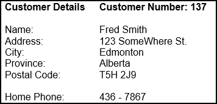
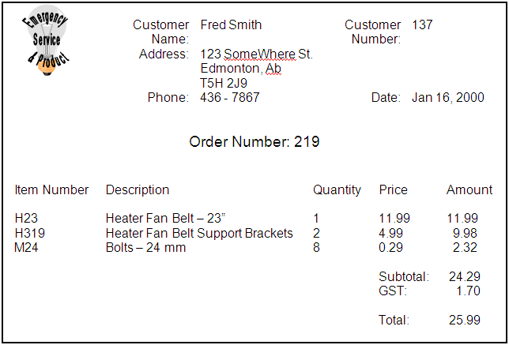

# ESP - Part 1

## Customer Details View

ESP keeps detailed information about each customer so that they can be contacted when needed or when a product needs to be sent in the mail. This information is kept on 3x5 cards as it is fairly static in size and doesn’t change very often. The cards look as follows:

Customer numbers are unique and are never reused by the company. A card is created for each new customer that buys from the company.

## Customer Orders View

ESP has preprinted order forms that they fill in by hand when a customer buys some of their product. The customer details are copied from the customer card onto the order form as well as details about the product ordered. Each order form has a preprinted sequential order number that is unique. The top portion of the forms looks as follows:

The forms are two part with carbon in between. The customer gets the top copy and ESP keeps the other. The ESP copy is filed by order number into a binder.

Because prices change on a fairly regular basis ESP would like to keep the following information:

- The current price for each item in inventory
- The price each item sold for at the time the item was sold

You are to take the information provided above and prepare a set of 3NF relational entities and produce a relational 3NF ERD for each view. Merge the two view schemas to produce a single set of tables (conceptual level schema) that will satisfy the requirements of both views.
