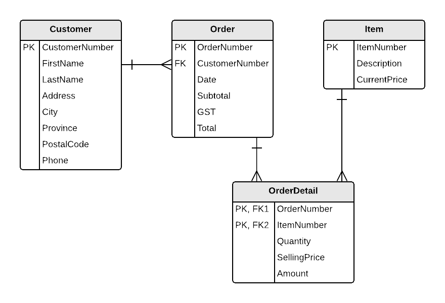

# ESP Document 1

This is a sample solution of normalizing the **Customer Details View** and the **Customer Orders View** in ESP Document 1. The styling conforms to the associated [Legend.md](normalization legend).

----

## Customer Details View

The Customer Details View and its resulting tables are based on the following form (taken from the original documentation).

This form was analyzed according to the rules of 0NF (Zero-Normal Form), 1NF (First-Normal Form), 2NF (Second-Normal Form), and 3NF (Third-Normal Form).

### 0NF

After performing Zero-Normal Form, a single table was generated: **Customer**.

**Customer:** (<b class="pk">CustomerNumber</b>, FirstName, LastName, Address, City, Province, PostalCode, HomePhone)

### 1NF – 3NF

No changes to the table in 1NF to 3NF.

### ERD

The following ERD represents the tables/entities from the **Customer Details View**.

----

## Customer Orders View

The Customer Orders View and its resulting tables are based on the following form (taken from the original documentation).

 
This form was analyzed according to the rules of 0NF (Zero-Normal Form), 1NF (First-Normal Form), 2NF (Second-Normal Form), and 3NF (Third-Normal Form).

### 0NF

After performing Zero-Normal Form, a single table was generated: **Order**.

**Order:**	(CustomerNumber, FirstName, LastName, Address, City, Province, PostalCode, Phone, Date, <b class="pk">OrderNumber</b>, <b class="rg">ItemNumber, Description, Quantity, CurrentPrice, SellingPrice, Amount</b>, Subtotal, GST, Total)

### 1NF

After performing First-Normal Form, a new table was generated: **OrderDetail**.

**Order:** (CustomerNumber, FirstName, LastName, Address, City, Province, PostalCode, Phone, Date, <b class="pk">OrderNumber</b>, Subtotal, GST, Total)

**OrderDetail:** (<b class="pk"><u class="fk">OrderNumber</u>, ItemNumber</b>, Description, Quantity, CurrentPrice, SellingPrice, Amount)

### 2NF

After performing Second-Normal Form, another new table was generated: **Item**.

**OrderDetail**	(<b class="pk"><u class="fk">OrderNumber</u>, <u class="fk">ItemNumber</u></b>, Quantity,  SellingPrice, Amount)

**Item**	(<b class="pk">ItemNumber</b>, Description, CurrentPrice)

### 3NF

After performing Third-Normal Form, another new table was generated: **Customer**.

**Order**	(<b class="pk">OrderNumber</b>, <u class="fk">CustomerNumber</u>, Date, Subtotal, GST, Total)

**Customer**	(<b class="pk">CustomerNumber</b>, FirstName, LastName, Address, City, Province, PostalCode, Phone)

### Tables after 3rd Normal Form

These are the tables/entities after normalizing the Customer Details View.

**Order**	(<b class="pk">OrderNumber</b>, <u class="fk">CustomerNumber</u>, Date, Subtotal, GST, Total)

**OrderDetail**	(<b class="pk"><u class="fk">OrderNumber</u>, <u class="fk">ItemNumber</u></b>, Quantity,  SellingPrice, Amount)

**Item**	(<b class="pk">ItemNumber</b>, Description, CurrentPrice)

**Customer**	(<b class="pk">CustomerNumber</b>, FirstName, LastName, Address, City, Province, PostalCode, Phone)

### Customer Orders View ERD

The following ERD for the *Customer Orders View* is based on the final 3rd normal form.

