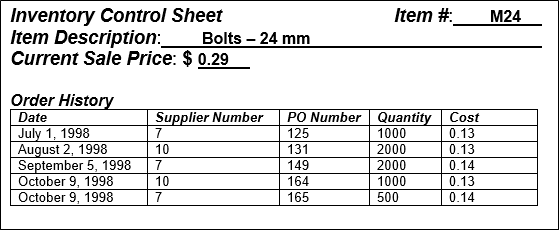
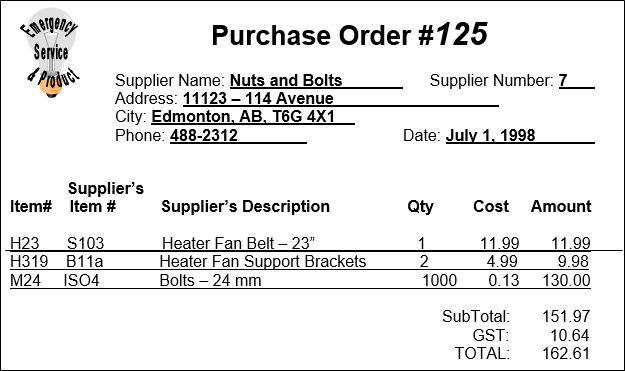

# ESP - Part 3

## Inventory Control

ESP keeps track of its inventory using a paper based ledger system where purchases from suppliers are recorded for each item that they have in stock. Every time an item is purchased through a purchase order, the date and quantity ordered of that item are recorded on this form's order history.

The system uses a form that looks as follows:

Item Numbers are unique and never reused. The Inventory Control Sheet records details of each item as well as all orders of that particular item from any given supplier.

ESP would like to be able to keep track of how many of each item they have *in stock* on an on-going basis so that they can use JIT (Just In Time) ordering rather than ordering when they run out. They would like the new system to keep a re-order value for each item as well as an in-stock count. If the in-stock count is less than or equal to the re-order level the item will be ordered from a supplier.

## Purchase Orders

When items are ordered from suppliers a Purchase Order is created. A sample Purchase Order is shown below.

Purchase Order (PO) numbers are unique and never reused. The same supplier always has the same *supplier number* (which *is also unique*) and the supplier details are hand-written on the PO every time.

The item number is the number assigned by ESP from the Inventory Control Sheet and is the same regardless of supplier the item is purchased from. The Supplier's Item Number and Description are specific to the supplier and may vary on different Purchase Orders. The cost of the item depends on the supplier and may vary between different purchase orders for the same supplier.

You are to take the information provided above and prepare a set of **3NF** relational entities and produce a relational **3NF ERD** for each view.

Merge the schemas for the Inventory Control view and the Purchase Orders view.

Merge the schema for the two views in ESP # 3 with the schema for the previous views to produce a single set of tables that will support the needs of all the ESP views completed to date (**Customer Details**, **Customer Orders**, **Customer Payments**, **Inventory Control** and **Purchase Orders**).
