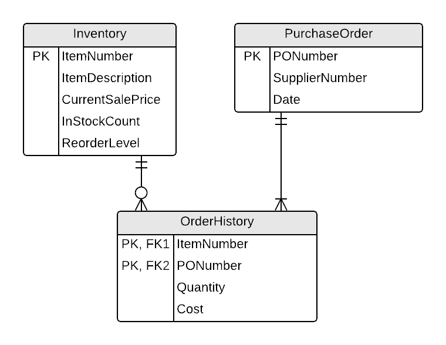
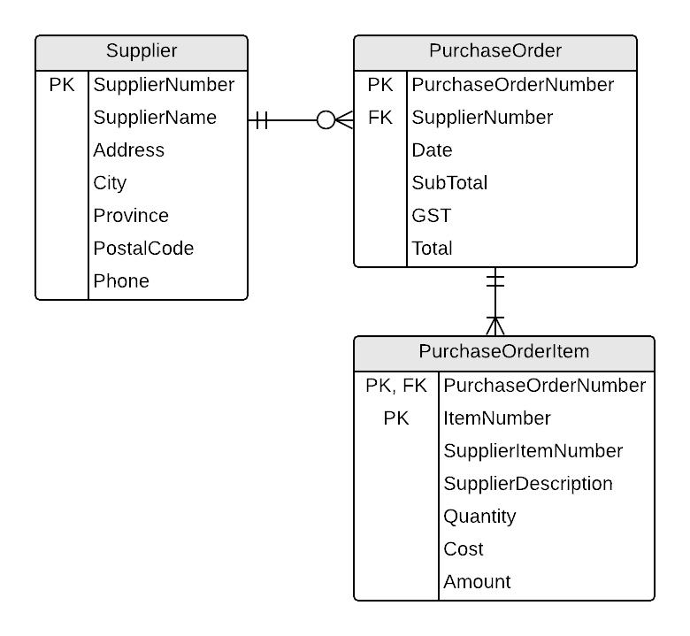

# ESP Document 3

The third specifications document for Emergency Service & Product (ESP) presented two additional paper-based forms: **Inventory Control Sheet** and **Purchase Orders**. This portion of the sample lab solution details how this form was analyzed and integrated into the database design from the previous documents. The styling conforms to the associated [Legend.md](normalization legend).

## Inventory Control Sheet

The Inventory Control Sheet and its resulting tables are based on the following form (taken from the original documentation).

This form was analyzed according to the rules of 0NF (Zero-Normal Form), 1NF (First-Normal Form), 2NF (Second-Normal Form), and 3NF (Third-Normal Form).

### 0NF

After performing Zero-Normal Form, a single table was generated: **Inventory**.

**Inventory** (<b class="pk">ItemNumber</b>, ItemDescription, CurrentSalePrice, <b class="rg">Date, SupplierNumber, PONumber, Quantity, Cost</b>,  InStockCount, ReorderValue)

### 1NF

After performing First-Normal Form, a single table was generated: **OrderHistory**.

**Inventory** (<b class="pk">ItemNumber</b>, ItemDescription, CurrentSalePrice, InStockCount, ReorderValue)

**OrderHistory** (<b class="pk"><u class="fk">ItemNumber</u>, PONumber</b>, SupplierNumber, Date, Quantity, Cost)

### 2NF

After performing First-Normal Form, a single table was generated: **PurchaseOrder**.

> **Q)** Why did I leave the `Quantity` and `Cost` in the **OrderHistory** entity while moving the `SupplierNumber` and `Date` to the **PurchaseOrder**?
> 
> **A)** 2NF is about *Partial Dependencies*, and I am looking to see if any of the attributes from **OrderHistory** were tightly related to ***only*** the `PONumber` attribute. It turns out that the `SupplierNumber` identifies the supplier for the Purchase Order and the `Date` identifies when the Purchase Order was placed. But, the `Quantity` describes the number of *Inventory Items* (`ItemNumber`) that were purchased (`PONumber`) and the `Cost` describes how much I paid for the item on that particular purchase order.

**OrderHistory** (<b class="pk"><u class="fk">ItemNumber</u>, <u class="fk">PONumber</u></b>, Quantity, Cost)

**PurchaseOrder** (<b class="pk">PONumber</b>, SupplierNumber, Date)

### 3NF

When performing Third-Normal Form, no transitive dependencies were identified, and the tables have not changed.

### ERD

----

## Purchase Orders

The Purchase Order and its resulting tables are based on the following form (taken from the original documentation).

This form was analyzed according to the rules of 0NF (Zero-Normal Form), 1NF (First-Normal Form), 2NF (Second-Normal Form), and 3NF (Third-Normal Form).

### 0NF

After performing Zero-Normal Form, a single table was generated: **PurchaseOrder**.

**PurchaseOrder** (<b class="pk">PurchaseOrderNumber</b>, SupplierName, SupplierNumber, Address, City, Province, PostalCode, Phone, Date, <b class="rg">ItemNumber, SupplierItemNumber, SupplierDescription, Quantity, Cost, Amount</b>,  SubTotal, GST, Total)

### 1NF

After performing First-Normal Form, a single table was generated: **PurchaseOrderItem**.

**PurchaseOrder** (<b class="pk">PurchaseOrderNumber</b>, SupplierName, SupplierNumber, Address, City, Province, PostalCode, Phone, Date, SubTotal, GST, Total)

**PurchaseOrderItem** (<b class="pk"><u class="fk">PurchaseOrderNumber</u>, ItemNumber</b>, SupplierItemNumber, SupplierDescription, Quantity, Cost, Amount)

### 2NF

After performing Second-Normal Form, no clear partial dependencies were identified; therefore, the tables have not changed.

> At first glance, it might appear that SupplierItemNumber and SupplierDescription are partial dependencies on ItemNumber (perhaps along with the Cost). However, further reflection reveals that this tracking of what name and price the supplier uses for the item is far too difficult to maintain; we should only be concerned with tracking the items belonging to ESP.
> Tracking supplier inventory names, numbers & costs is a "rabbit trail" of volatile data that we can't (and don't want to) pursue.

### 3NF

After performing Third-Normal Form, a new table was generated: **Supplier**.

**PurchaseOrder** (<b class="pk">PurchaseOrderNumber</b>, <u class="fk">SupplierNumber</u>, Date, SubTotal, GST, Total)

**Supplier** (<b class="pk">SupplierNumber</b>, SupplierName, Address, City, Province, PostalCode, Phone)

**PurchaseOrderItem**(<b class="pk"><u class="fk">PurchaseOrderNumber</u>, ItemNumber</b>, SupplierItemNumber, SupplierDescription, Quantity, Cost, Amount)

### ERD

