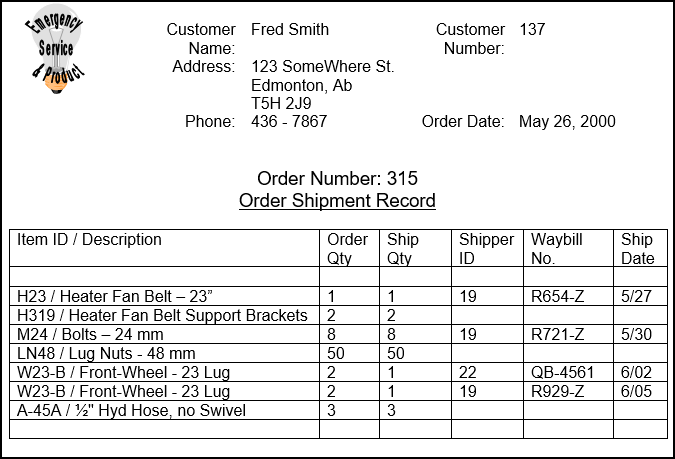

# ESP - Part 5

## Shipper Details View

ESP keeps a set of 3x5 cards of all the local shipping companies that they use to deliver parts to customers. This information is fairly static and doesn't change very often. It is kept largely to make it easier to find the shipper's phone number when sending out orders to the customer.

Shipper numbers are unique and are never reused by the company. A card is created for each new shipper that the company hires out for local shipments.

## Order Shipment View

Customers place orders for parts that can't be filled right away. In fact, ESP has agreements with several local shipping companies to deliver part the ESP customers (such as farmers or local repair shops).

ESP has preprinted order forms that they fill in by hand when sending the customer's order items via a local shipping company. The order details are copied from the original customer's order form and as products become available for shipping to the customer, the item ID and description, the shipper's ID, waybill number, ship date, and quantity shipped are filled in by hand. Items can be part-shipped (meaning that the partial quantity can be shipped), and shipments can include many items.

At most, each customer will get a single shipment in a day; outstanding items on the order are delivered at a later date as they become in-stock. Here is a sample shipment form for a customer.

When a shipping company picks up an order to deliver to the customer, the shipping company's ID is written on the form, a waybill (from the shipping company) is filled out listing the parts being shipped, and a carbon copy of the waybill is stapled to this order shipment form. When the shipment has been fully met, this form (along with the waybills) is filed with the customer's original order form. Because each shipping company's waybills are different, there is no need to create a database model of the individual waybills
