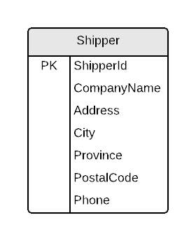
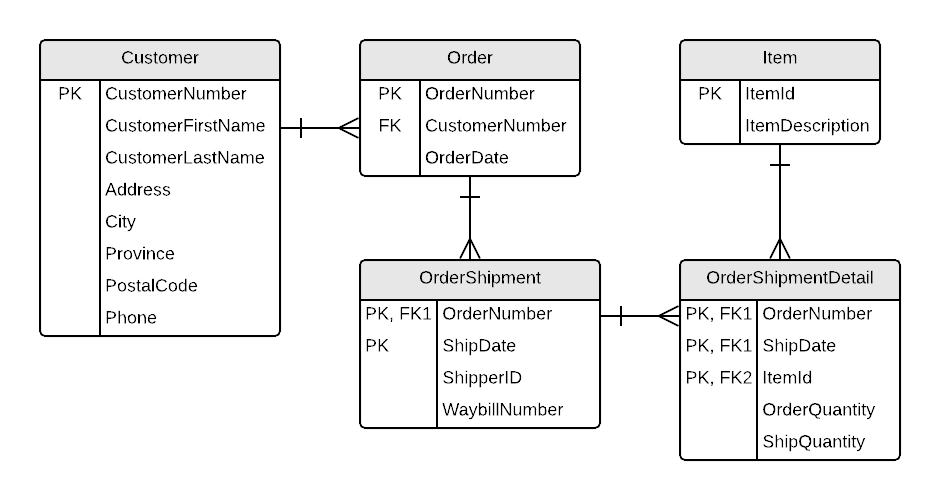

# ESP Document 5

## Shippers Details View

### 0NF

**Shipper:** (<b class="pk">ShipperNumber</b>, CompanyName, Address, City, Province, PostalCode, Phone)

### 1NF – 3NF

No changes to the table in 1NF to 3NF.

### ERD

The following ERD represents the tables/entities from the Shipper Details View.

## Order Shipment View

### 0NF

After performing Zero-Normal Form, a single table was generated: **Order**

**Order**: (<b class="pk">OrderNumber</b>, CustomerFirstName, CustomerLastName, CustomerNumber, Address, City, Province, PostalCode, Phone, OrderDate, <b class="rg">{</b> <b class="rg">{</b> ItemId, ItemDescription, OrderQuantity, ShipQuantity<b class="rg">}</b> , ShipperId, WaybillNumber, ShipDate<b class="rg">}</b>)

### 1NF

After performing First-Normal Form, two additional tables were generated: **OrderShipment** and **OrderShipmentDetail**

**Order**: (<b class="pk">OrderNumber</b>, CustomerFirstName, CustomerLastName, CustomerNumber, Address, City, Province, PostalCode, Phone, OrderDate)

**OrderShipment**: (<b class="pk"><u class="fk">OrderNumber</u>, WaybillNumber</b>, ShipperId, ShipDate)

**OrderShipmentDetail**: (<b class="pk"><u class="fk">OrderNumber, WaybillNumber</u>, ItemId</b>, ItemDescription, OrderQuantity, ShipQuantity)

### 2NF

After performing Second-Normal Form, two additional tables were generated: **Waybill** and **Item**.

**OrderShipment**: (<b class="pk"><u class="fk">OrderNumber</u>, <u class="fk">WaybillNumber</u></b>)

**Waybill**: (<b class="pk">WaybillNumber</b>, ShipperId, ShipDate)

**OrderShipmentDetail**: (<b class="pk"><u class="fk">OrderNumber, WaybillNumber</u>, <u class="fk">ItemId</u></b>, OrderQuantity, ShipQuantity)

**Item**: (<b class="pk">ItemId</b>, ItemDescription)

### 3NF

After performing Third-Normal Form, an additional table was generated: **Customer**

**Order**: (<b class="pk">OrderNumber</b>, <u class="fk">CustomerNumber</u>, OrderDate)

**Customer**: (<b class="pk">CustomerNumber</b>, CustomerFirstName, CustomerLastName, Address, City, Province, PostalCode, Phone)

### Final Tables

**Order**: (<b class="pk">OrderNumber</b>, <u class="fk">CustomerNumber</u>, OrderDate)

**Customer**: (<b class="pk">CustomerNumber</b>, CustomerFirstName, CustomerLastName, Address, City, Province, PostalCode, Phone)

**OrderShipment**: (<b class="pk"><u class="fk">OrderNumber</u>, <u class="fk">WaybillNumber</u></b>)

**Waybill**: (<b class="pk">WaybillNumber</b>, ShipperId, ShipDate)

**OrderShipmentDetail**: (<b class="pk"><u class="fk">OrderNumber, WaybillNumber</u>, <u class="fk">ItemId</u></b>, OrderQuantity, ShipQuantity)

**Item**: (<b class="pk">ItemId</b>, ItemDescription)

### ERD

<!-- -->

----

