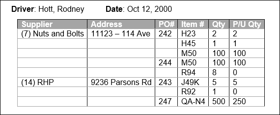
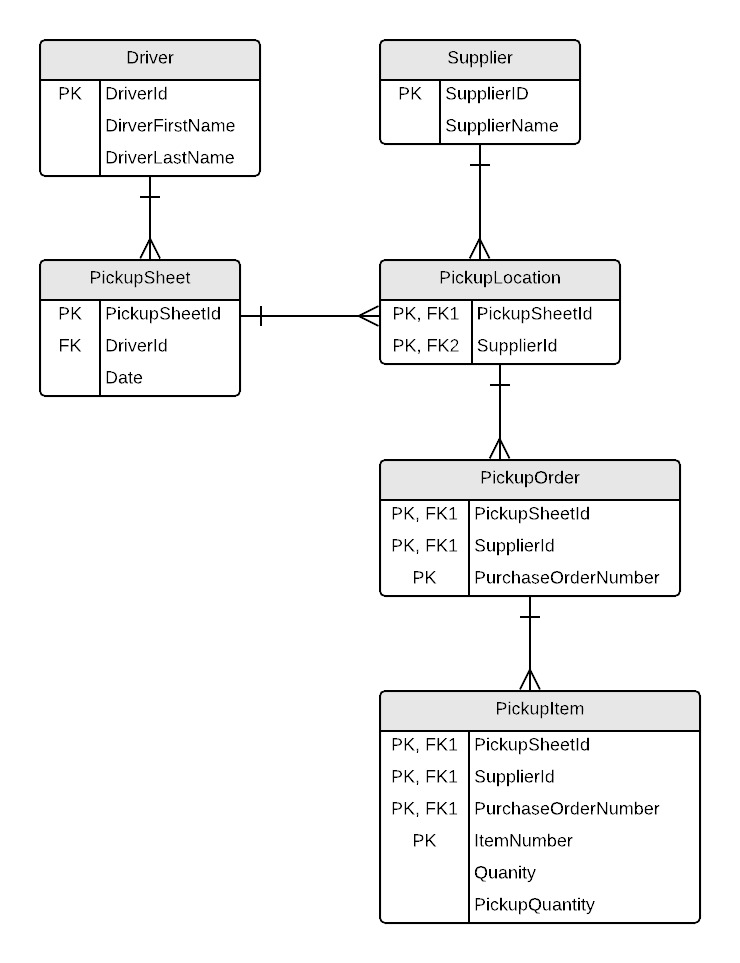

# ESP - Part 6

## Pickup Driver Details View

ESP has two employees in the city who do local parts pickup from their suppliers and receiving at the end of the day. Each driver covers a different area of the city, and they begin the morning by dividing the pickups and summarizing their pickup sheets. By mid-morning, they head out to do their pickups and they return by mid-afternoon, at which time they check in their pickup sheets and stock the shelves.

The following is a sample pickup sheet for one of the drivers.

## Analysis

### 0NF – Identify Meta-data

**PickupSheet** (<b class="pk">PickupSheetId†</b>, DriverId‡, DriverFirstName, DriverLastName, Date <b class="rg">{</b>SupplierId, SupplierName, Address <b class="rg">{</b>PurchaseOrderNumber, <b class="rg">{</b>ItemNumber, Quantity, PickupQuantity<b class="rg">} } }</b>)

> **Notes:**
> **†** - PickupSheetId is a technical key that was introduced in 0NF to uniquely identify each pickup sheet.
> **‡** - DriverId is a technical key that was introduced in 3rd Normal Form and "back-filled" to 0NF.

### 1NF – Separate Repeating Groups

**PickupSheet** (<b class="pk">PickupSheetId</b>, DriverId, DriverFirstName, DriverLastName, Date)

**PickupLocation** (<b class="pk"><u class="fk">PickupSheetId</u>, SupplierId</b>, SupplierName, Address)

**PickupOrder** (<b class="pk"><u class="fk">PickupSheetId†, SupplierId</u>, PurchaseOrderNumber</b>)

**PickupItem** (<b class="pk"><u class="fk">PickupSheetId†, SupplierId, PurchaseOrderNumber</u>, ItemNumber</b>, Quantity, PickupQuantity)

### 2NF – Identify Partial Dependencies

**PickupLocation** (<b class="pk"><u class="fk">PickupSheetId</u>, <u class="fk">SupplierId</u></b>)

**Supplier** (<b class="pk">SupplierId</b>, SupplierName, Address)

### 3NF – Identify Transitive Dependencies

**PickupSheet** (<b class="pk">PickupSheetId</b>, <u class="fk">DriverId‡</u>, Date)

**Driver** (<b class="pk">DriverId‡</b>, DriverFirstName, DriverLastName)

### ERD

