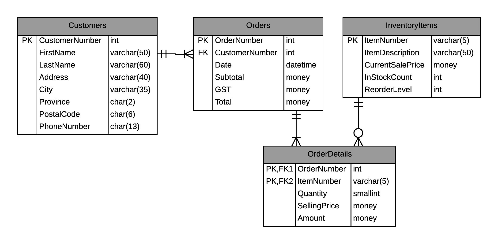
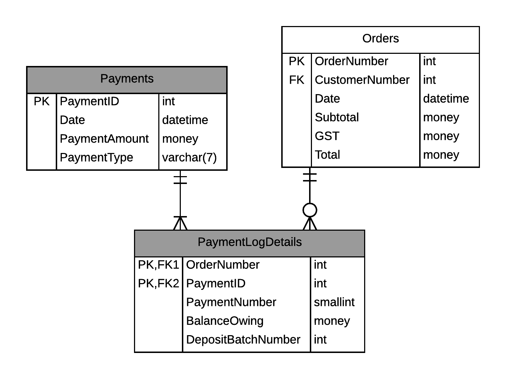

# Introduction to SQL

## The ESP Database (Specifcations 1 - 4)

### Implementing Tables for Spec 1

To support the first specifications document for Emergency Service and Product, four tables need to be created: Customers, Orders, InventoryItems, and OrderDetails.

In addition to the details in the ERD, the following business rules need to be supported through constraints on the columns:

- All data is required, except for the following:
    - Customers.PhoneNumber
    - InventoryItems.ItemDescription
- The following must be identity columns:

| Table | Column | Initial Value | Increment |
| ----- | ----- | ----- | ----- |
| Customer |CustomerNumber | 100 | 1 |
| Orders | OrderNumber | 200 | 1 |
    
- The following business rules must be enforced:
    
| Table | Requirement |
| ----- | ----- |
| Customers | The Postal Code must follow the pattern for Canadian postal codes, without the space: `A#A#A#` |
| Customers | Phone numbers must follow the pattern of `(###)###-####` |
| Customers | The default province should be Alberta, and all provinces must expressed in their two-character code format. Only Candian provinces/territories are accepted. |
| Orders | The order's subtotal must be greater than zero.|
| Orders | The order's GST cannot be negative. |
| Orders | The order total should be a calculated value. |
| InventoryItems | Inventory items must have a positive, non-zero sale price |
| OrderDetails | Order detail quantities must be greater than zero, and should default to one item.|
| OrderDetails | The order detail selling price must not be less than zero (a sale price of zero is acceptable under some circumstances). |
| OrderDetails | The order detail amount should be a calculated value. |
    
#### Changes for Spec 1 Tables

A number of small changes have been identified for the tables in the first specifications document. These changes should be made without dropping/re-creating the tables.

- Customer address information is no longer required (address, city, etc.)
- The customer first and last name must be at least two characters in length.
- The order data must default to the current date.
- Inventory items require a description.
- Customers should be searchable by first and/or last names.

### Implementing Tables for Spec 2

To implement the tables for ESP Specifications 2, we need to add two more tables: Payments and PaymentLogDetails.

All of the columns are required columns, and the Payments.PaymentID must be a database-generated ID that starts at 1 and increments by 1. also, the PaymentType can only be 'Cash', 'Cheque' or 'Credit'. No other constraints need to be enforced at this time.

### Implementing Tables for Spec 3

### Implementing Tables for Spec 4

